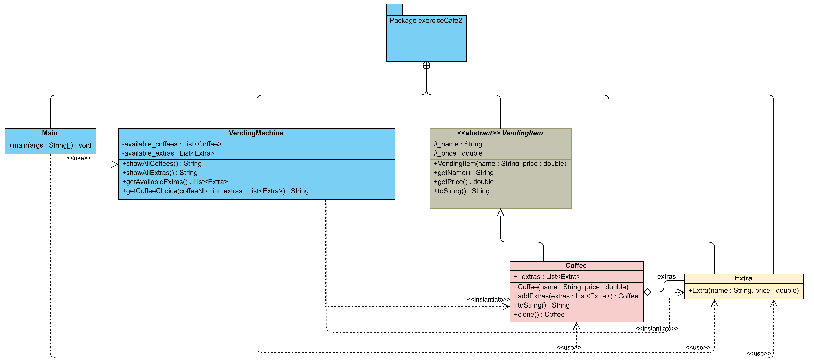

**Nom/Prénom Etudiant 1 : Janin Ewald**

# Rapport TP2a

### Itération 2

Ma solution pour cette question se compose de 5 classes, dont une classe abstraite, comme nous pouvons le voir sur le diagramme de classes ci-dessous : 

La classe `VendingItem` est _abstraite_. Elle représente les items qui peuvent être vendus dans le distributeur, que ce soit seuls ou en accompagnement d'un autre item. Avec les attributs permettant de représenter ces items, et quelques méthodes déjà définies, cet héritage permet de ne pas avoir à dupliquer de code dans les classes `Coffee` et `Extra`.

La classe `Extra` ne possède ni méthodes ni attributs, seulement un constructeur, elle représente les suppléments que l'on peut rajouter à une boisson.

La classe `Coffee` représente une boisson, avec ou sans suppléments, et on peut ajouter des suppléments à une instance de `Coffee`.

La classe `VendingMachine` sert à instancier au lancement de l'application les différentes boissons et les différents suppléments disponibles, puis permet de récupérer des chaînes de caractères servant à l'affichage pour le consommateur. C'est avec cette classe que le choix du type de café est fait.

Enfin, la classe `Main` est celle qui affiche les informations à l'utilisateur et le fait choisir sa boisson. Elle affiche toutes les possibilités de cafés au consommateur, et une fois qu'il a choisi son café, elle lui propose tous les suppléments un à un, ce qui n'est pas très ergonomique.

L'ajout de nouveaux éléments dans cette architecture est très simple, il suffit de les rajouter avec les autres dans la classe `VendingMachine`. Cependant, il n'est pas possible avec cette architecture de définir ou modifier un comportement spécifique à un des items vendus. De plus, l'architecture est brouillonne, les principes SOLID ne sont pas respectés, et elle n'est pas très propre pour y apporter des évolutions.

Il faudrait cloisonner mieux les différents types d'objets, et permettre d'avoir des fonctionnalités différentes pour chacun d'entre eux, c'est ce que nous allons voir tout de suite avec le _design pattern Decorateur_.

### Itération 3
*présentez votre solution en donnant le diagramme de classes et en expliquant comment vous avez appliqué de design pattern Decorateur*
*discutez la facilité d’ajouter de nouveaux éléments (boissons et suppléments) *
*conclusion(s) ?*

Dans cette partie, j'ai repris en partie le design de la partie d'avant : la classe `Main` sert toujours à afficher les infos au client et à récupérer sa saisie, et la classe `VendingMachine` sert toujours à lister les choix possibles et à faire le processing de la commande du client.

Cependant, cette dernière a un peu évolué, ainsi que les classes représentant les boissons et les suppléments, qui respectent désormais le _design pattern Décorateur_, comme on peut le voir sur le diagramme de classes ci-dessous :

Mon *composant* est la classe _abstraite_ `Drink`, qui possède les attributs et méthodes nécéssaires pour représenter une boisson. Ces méthodes peuvent ainsi être redéfinies dans les implémentations concrètes de cette classe, les classes `Colombia`, `Deca` et enfin `Espresso`. Celles sont ont également deux constantes pour représenter le nom et le prix de la boisson.

Mon *décorateur* correspond à la classe _abstraite_ `Extra`, qui symbolise tous les suppléments pouvant être ajoutés aux boissons. Contrairement à ma classe `Drink`, dans `Extra` j'ai des méthodes _abstraites_, pour forcer les classes filles à les implémenter, pour être sûr que les infos dont j'ai besoin sont bien disponibles (nom et prix). Comme pour les boissons, j'ai deux constantes dans chaque classe pour représenter le nom et le prix du supplément.

Dans la classe `VendingMachine`, j'utilise [**Reflections**](https://github.com/ronmamo/reflections) pour récupérer tous les items disponibles à la vente, tant les boissons que les suppléments, et j'ai fait en sorte de pouvoir écrire la commande voulue de manière littérale, que je trouve plus sympathique ici que proposer un choix numéroté par exemple. 

Avec ce _design pattern Decorateur_, mon code est beaucoup plus structuré, le projet est mieux organisé, bien plus évolutif, je respecte les principes SOLID (dans la mesure du possible avec l'utilisation de [**Reflections**](https://github.com/ronmamo/reflections)), et surtout le projet est beaucoup plus souple ! En effet, si je ne veux pas qu'un supplément autre que `Caramel` puisse être ajouté après le supplément `Chantilly`, il me suffirai de contrôler dans les autres classes de supplément que mon objet de type `Drink` passé en paramètre du constructeur n'est pas une instance de `Chantilly` ni de `Caramel` (pour que le caramel soie le dernier ajouté pour l'esthétique).

On a donc une meilleure souplesse d'utilisation et une architecture mieux organisée et plus évolutive avec ce design pattern.

