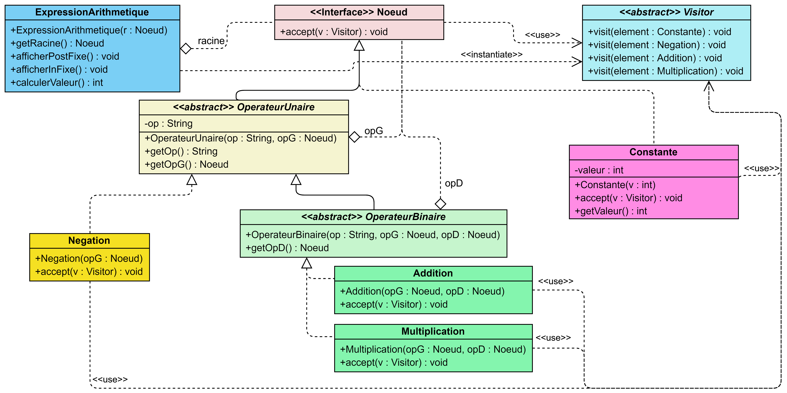

**Nom/Prénom Etudiant : Janin Ewald**

# Rapport TP2b

## Question 2
Ajouter une nouvelle opération dans l'expression semble être assez bien faisable, il suffit de dupliquer et réfactorer une classe opération existante, sauf si elle nécéssite plus de deux noeuds, auquel cas il faudrait créer une classe `OperateurTernaire` (ou plus, mais avec tous les intermédiaires) sur le modèle des `OperateurUnaire` et `OperateurBinaire`. 

En revanche, ajouter un des types d'algorithmes de parcours de l'énoncé me paraît déjà plus lourd : il va falloir rajouter une méthode dans plusieurs classes (les classes _operateur_ et la `Constante`). Mais ajouter un parcours en profondeur ou en largeur sur ce graphe me paraît vraiment complexe et nécessitera de revoir l'architecture, ou alors de rajouter une méthode dans de nombreuses classes.

## Question 3
Les ajouts que j'ai fait pour cette question sont la classe abstraite `Visitor` ainsi que les méthodes `accept(v : Visitor)` dans l'interface `Noeud` ainsi que dans toutes les classes concrètes implémentant cette interface. J'ai également ajouté le getter de _valeur_ dans `Constante`.

Conformément au _design pattern Visitor_, j'ai dans la classe _abstraite_ `Visitor` une méthode par classe concrète pouvant être visitée par une instance d'une classe héritant de `Visitor`. C'est grâce au principe du **double dispatch** que je vais appeler les bonnes méthodes.

Le diagramme UML ci-dessous ne comporte pas de classes visiteurs concrètes, car je n'avais pas encore fait la suite lors de ma réponse à cette question, mais c'est bien l'`ExpressionArithmetique` qui instancie et utilise le `Visitor`, dans ses méthodes de calcul et d'affichage de l'expression.

## Question 8
*Discutez la facilité d’ajouter d'autres opérations sur l'expression arithmétique.*
*Discutez la facilité d’ajouter d'autres types de Noeud à l'expression arithmétique.*
